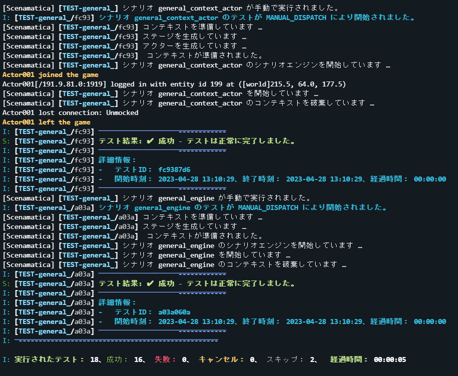

  <h1>Scenamatica</h1>

 

Enhance PaperMC plugin quality with its automation framework: YAML-defined tests, CI/CD integration.

[日本語/Japanese](README.md)

## Overview

Scenamatica is an end-to-end automation framework for PaperMC plugins, which is the world's first.
It automatically verifies the functionality and abnormality of the plugin through multi-scenario tests defined in YAML.
By utilizing Scenamatica, regression tests can be conducted quickly, allowing engineers to focus on developing PaperMC plugins.
This process improves the quality of plugins and provides a better experience for both users and developers.
Additionally, by integrating it into existing CI/CD pipelines, plugin quality can be continuously monitored.

## Features

+ Automated scenario testing for PaperMC plugins
  Scenario testing is a test to check if the plugin operates and outputs as expected by scenario-izing plugin operation and output.
  Scenamatica realized the automation of scenario testing for PaperMC plugins, which is the world's first.
+ YAML scenario definition
  By defining scenarios in YAML, the readability of scenarios is improved and adding/changing scenarios becomes easy.
  You don't need to write tedious test code, and even non-Java/Kotlin programmers can add tests.
+ Integration with CI/CD
  By integrating with CI/CD such as GitHub Actions, plugin quality can be continuously monitored.
  You can require a successful test before merging a pull request.

## Language Support

| Language    | In the plugin      | In documents       |
|:------------|:-------------------|:-------------------|
| 日本語         | :white_check_mark: | :white_check_mark: |
| English(US) | :white_check_mark: | :x:                |
| 日本語(関西弁)    | :white_check_mark: | :x:                |

## Installation and Usage

Please refer to [the documentation](https://scenamatica.kunlab.org) for installation and usage.

## Screenshots

