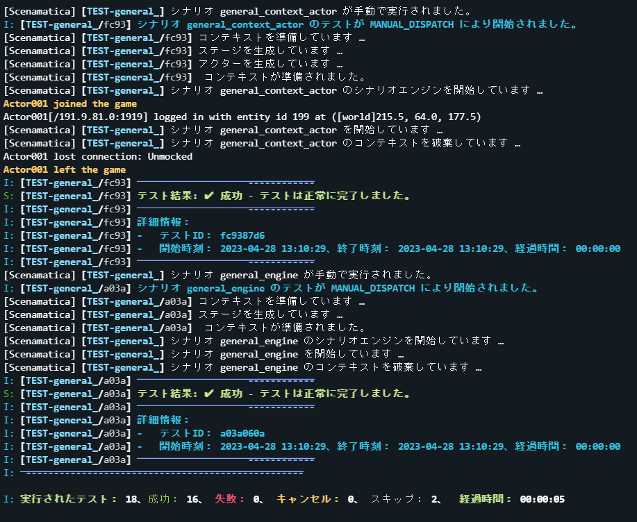
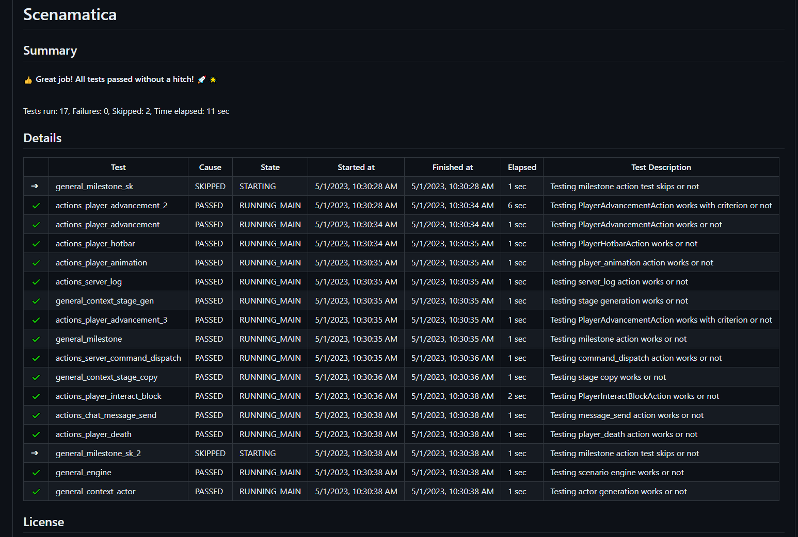
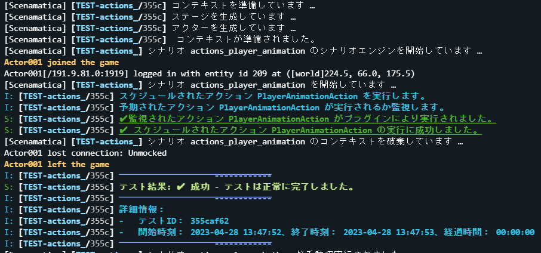
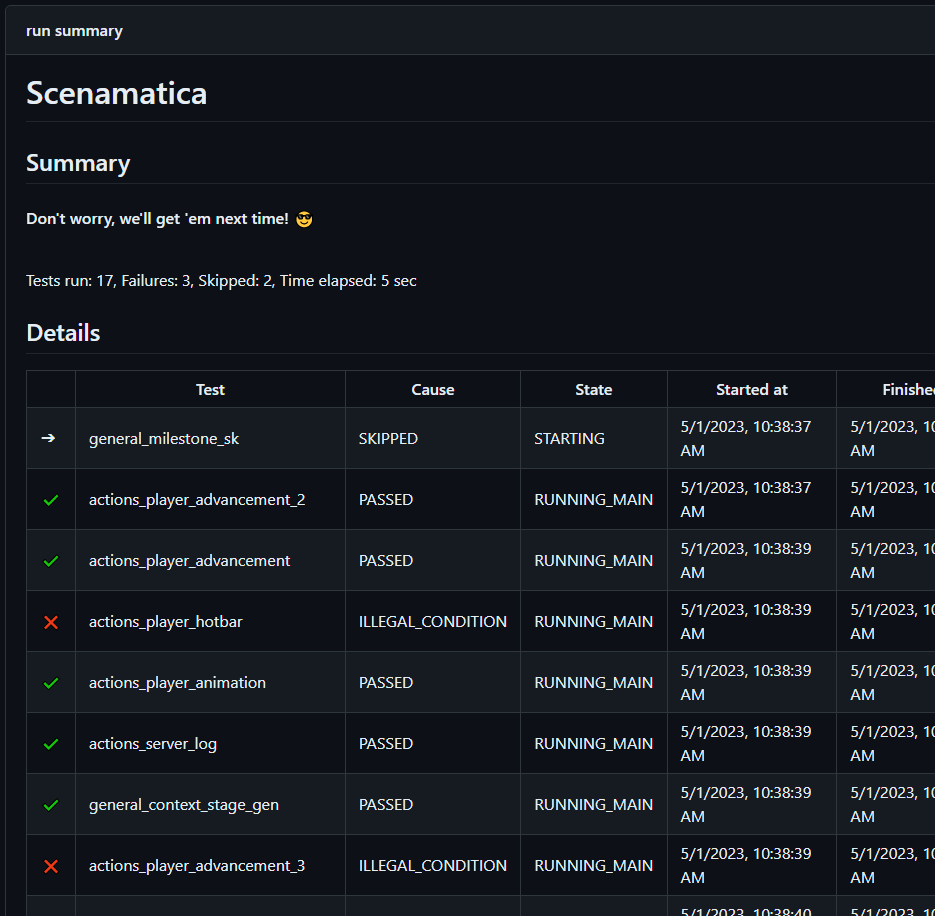

  <h1>Scenamatica</h1>

 

Enhance PaperMC plugin quality with its automation framework: YAML-defined tests, CI/CD integration.

YAMLで定義されたテスト、CI/CD統合により、PaperMCプラグインの品質を向上させます。

[English](README.en.md)

## 概要

Scenamaticaは、世界初の PaperMC プラグインに特化したエンドツーエンドの自動化フレームワークです。
YAML で予め定義されたマルチシナリオのテストにより、プラグインの機能正常性と異常性を自動的に検証します。
Scenamaticaの活用により、リグレッションテストをスピーディに実施でき、PaperMCプラグインの開発にエンジニアが集中できるようになります。  
このプロセスにより、プラグインの品質が向上し、ユーザーと開発者、両者にとってより優れたエクスペリエンスが提供されます。
また、既存の CI/CD パイプラインに統合することで、プラグインの品質を継続的に監視できます。

## 特徴

+ 世界初の PaperMC プラグインに特化したシナリオテスト  
  シナリオテストとは、プラグインの操作や出力をシナリオ化し、問題なく動作するかを確認するテストです。  
  Scenamatica は、 PaperMC プラグインでシナリオテストの自動化を世界初で実現しました。
+ YAML で定義されたシナリオ  
  YAML でシナリオを定義することで、シナリオの可読性を高め、シナリオの追加・変更を容易にします。  
  面倒なテストコードを書く必要はなく、 Java/Kotlin プログラマでなくてもテストを追加できます。
+ CI/CD との統合  
  GitHub Actions などの CI/CD に統合することで、プラグインの品質を継続的に監視できます。  
  プルリクエストをマージする前に、テストに成功することを要求できます。

## 言語サポート

| 言語          | プラグイン              | ドキュメント             |
|:------------|:-------------------|:-------------------|
| 日本語         | :white_check_mark: | :white_check_mark: |
| English(US) | :white_check_mark: | :x:                |
| 日本語(関西弁)    | :white_check_mark: | :x:                |

## インストールと使用方法

詳しくは[こちら](https://scenamatica.kunlab.org)を参照してください。

## スクリーンショット

