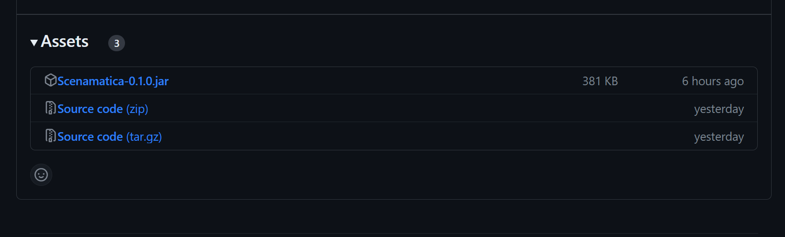

import Requirements from "/src/components/Requirements";
import BelowDocument from "/src/components/BelowDocument";

# Scenamatica をインストールする

Scenamatica をサーバにインストールする方法を説明しています。

---

## このページの前提条件 {#prerequisites}

Scenamatica を使用するには, 以下の条件を満たす必要があります。

<Requirements requirements={[
  {
    name: "Java",
    version: "8 以上",
    link: "https://www.java.com/ja/download/",
    description: "Java 11 以上が推奨されていますが, 最低要件は Java 8 です。"
  },
  {
    name: "PaperMC",
    version: "1.13.2, 1.14.x, 1.15.x, 1.16.x, 1.17.x",
    link: "https://papermc.io/downloads",
    description: "これら以外のバージョンでは動作しません。"
  }
]}/>

:::danger
Scenamatica は, 通常の Bukkit/SpigotMC では動作しません。代わりに<b>[PaperMC](https://papermc.io/)</b> を使用することを検討してください。  
PaperMC は, Bukkit/SpigotMC の高機能改造版です。完全な互換性を持ちつつも, パフォーマンスが向上しています。
:::

## Scenamatica プラグインをインストールする {#install}

### ステップ1. 最新のプラグイン JAR をダウンロードする

1. [Scenamatica - GitHub](https://github.com/TeamKUN/Scenamatica/releases/latest)にアクセスし, 最新のリリースを確認します。
2. ページ下部の `Assets` 内の, `Scenamatica-<バージョン>.jar` をクリックしてプラグインをダウンロードします。
3. 任意の場所に保存してください。

:::tip
✨ このドキュメントの画像はクリックして拡大できます！ ✨
:::

### ステップ2. プラグインをサーバに配置する

あなたが普段プラグインをサーバに追加するように, サーバのプラグインフォルダ（e.g. `plugins/`）にダウンロードした Scenamatica を配置します。

### ステップ3. サーバを再起動する

サーバを再起動またはリロードし, Scenamatica を有効化します。
サーバが再起動されたら, Scenamatica が正常に動作していることを確認してください。

---

## 糸冬 了

お疲れ様でした。
次のチュートリアルでは, 初めてのシナリオを書く方法について説明しています。

<BelowDocument docId="getting-started/tutorials/writing-my-first-scenario"
               label="チュートリアル：初めてのシナリオを書く"
               tutorial
/>

また, 以下のカードから Scenamatica の設定について学べます：

<BelowDocument docId="getting-started/configuration"
               label="Scenamatica の設定"
              
/>
