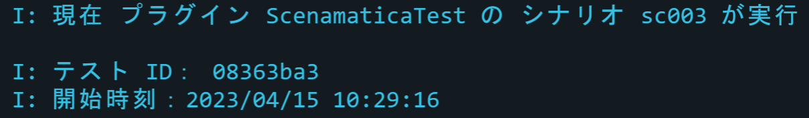
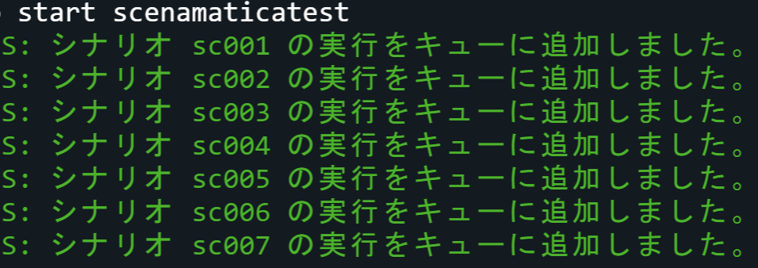
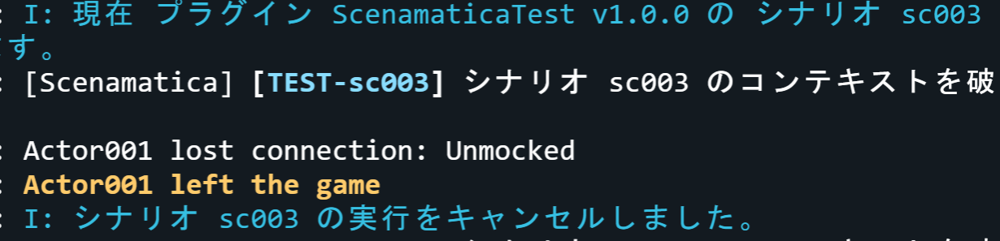
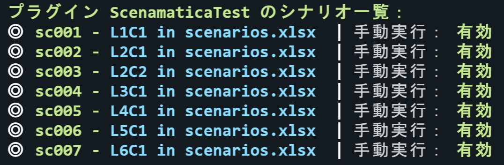

# シナリオコマンド

シナリオに関するコマンドです。

---

## <kbd>/scenamatica scenario</kbd> {#scenario}

シナリオに関するコマンドです。

### エイリアス {#aliases}

*(なし)*

### コマンド構文 {#syntax}

- `scenario <サブコマンド> [引数…]`

### 権限 {#permission}

- `scenamatica.use.scenario`

## <kbd>scenario status</kbd> {#status}

現在進行しているシナリオの状態を表示します。

### エイリアス {#aliases}

*(なし)*

### コマンド構文 {#syntax}

- `scenario status`

### 権限 {#permission}

- `scenamatica.use.scenario.status`

### スクリーンショット {#screenshots}

## <kbd>scenario start</kbd> {#start}

新しい[シナリオのセッション](/docs/use/scenario#scenario-session)を作成し、引数に指定されたシナリオを追加します。

第二引数以降を省略した場合は、そのプラグインの全てのシナリオが実行されます。  

### エイリアス {#aliases}

*(なし)*

### コマンド構文 {#syntax}

- `scenario start <プラグイン名> [シナリオ名1] [シナリオ名2]...`

### 権限 {#permission}

- `scenamatica.use.scenario.start`

### スクリーンショット {#screenshots}

## <kbd>scenario cancel</kbd> {#cancel}

現在実行されているシナリオの実行を中止します。  
中止されたテストは [`CANCELLED`](/docs/use/test#:~:text=CANCELLED) で終了します。

シナリオが実行されていない場合は何もしません。

:::tip

実行結果をクリックすると、シナリオを実行するコマンドを補完します（プレイヤのみ）。 

:::

### エイリアス {#aliases}

*(なし)*

### コマンド構文 {#syntax}

- `scenario cancel`

### 権限 {#permission}

- `scenamatica.use.scenario.cancel`

### スクリーンショット {#screenshots}

## <kbd>scenario list</kbd> {#list}

プラグインのシナリオ一覧を表示します。シナリオが手動で実行可能な場合（`manual_dispatch` トリガがシナリオに含まれる場合）は、
クリックして実行コマンドを補完します。

### エイリアス {#aliases}

*(なし)*

### コマンド構文 {#syntax}

- `scenario list <プラグイン名>`

### 権限 {#permission}

- `scenamatica.use.scenario.list`

### スクリーンショット {#screenshots}

