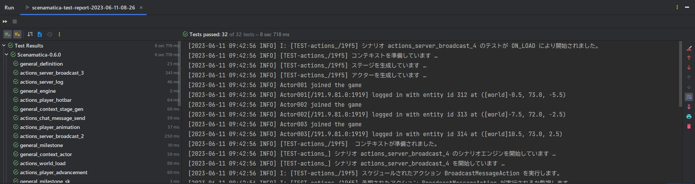
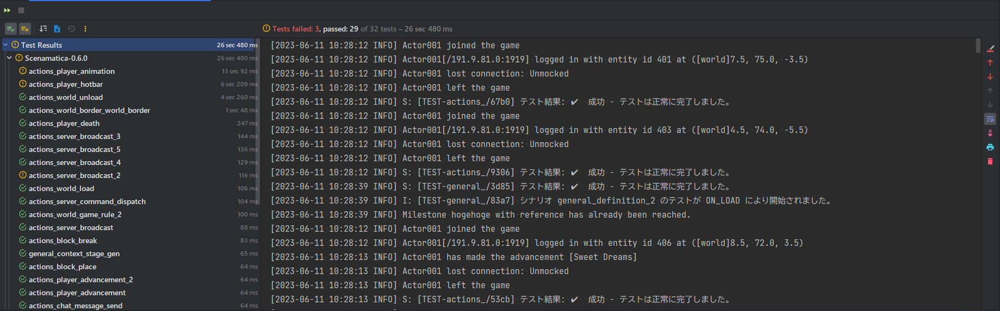

import Requirements from "/src/components/Requirements";

# JUnit 対応ツールと Scenamatica の連携

JUnit XML 形式のレポートを利用できるツールとの連携をする方法を説明しています。

---

## このページの前提条件 {#requisites}

<Requirements requirements={[
  {
    name: "Scenamatica",
    version: "v0.7.0"
  }
]} />

## 概要  {#overview}

[JUnit XML](https://www.ibm.com/docs/ja/developer-for-zos/9.1.1?topic=formats-junit-xml-format) は, 
有名なテストフレームワークである [JUnit](https://junit.org/junit5/) およびビルドツールの [Apache Ant](https://ant.apache.org/) によって利用されている, 
テスト結果を記録するための XML 形式のフォーマットです。  
現在はこの形式を用いてテスト結果を表すことがデファクトスタンダートとなっており, 多数のツールがこの形式に対応しています。

Scenamatica では, JUnit XML 形式でテスト結果を出力できます。出力した JUnit XML を IDE などで読み込み, 高度なビューでテスト結果を確認できます。

### JUnit XML の出力 {#junit-xml-output}

JUnit XML は, デフォルトで `plugins/Scenamatica/reports` 配下に出力されるようになっています。  
有効/無効や出力先の変更は, [こちら](/docs/getting-started/configuration#reporting-junit)から設定できます。

### JUnit XML を利用した IDE との連携 {#ide}

JUnit XML は, [IntelliJ IDEA](https://www.jetbrains.com/ja-jp/idea/) や [Visual Studio Code](https://azure.microsoft.com/ja-jp/products/visual-studio-code/),
[Eclipse](https://www.eclipse.org/) などのほとんどの IDE で読み込めます。  
IDE での読み込み方は, それぞれの IDE のドキュメントを参照してください。

### スクリーンショット {#ide-screenshot}

IntelliJ IDEA で Scenamatica の自己テストの結果を読み込んだ例を以下に示します。

