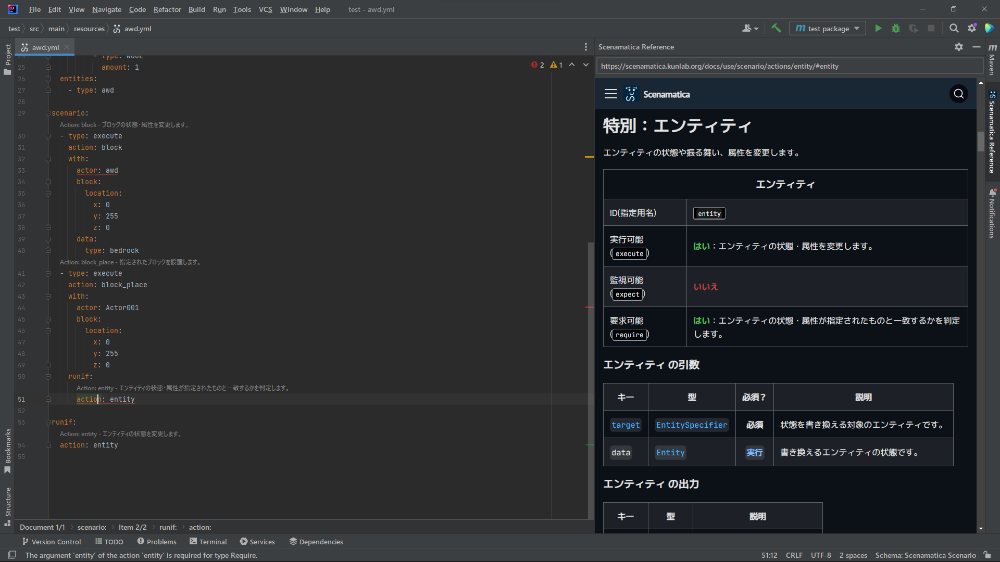

# Scenamaticer を利用した IntelliJ IDEA と Scenamatica の連携

このページでは,  [Scenamaticer] を利用した [IntelliJ IDEA] と Scenamatica の連携について説明しています。

---

## 概要 {#overview}

[Scenamaticer] は,  Scenamatica 公式の [IntelliJ IDEA] Platform 向けのプラグインです。

## 機能概要 {#features-overview}

+ **シナリオのテンプレートおよびシナリオ作成ウィザード**  
  予め用意されたテンプレートを利用して, より簡単にシナリオを作成できます。
  ウィザード形式で値を入力して, 最低限の情報を入力するだけでシナリオを作成します。
+ **組み込みリファレンスブラウザ**  
  Scenamatica のリファレンスを [IntelliJ IDEA] 上で閲覧できます。  
  型解析により, YAML ファイル内のシナリオ要素をクリックすることで, それに関するリファレンスを自動表示できます。
+ **重複シナリオ名検出**  
  Scenamatica Daemon の使用上, 同じプラグインが同一名のシナリオを登録することはできません。  
  このプラグインは, そのような重複を検出し, エラーを報告します。
+ **アクションの説明の Code Vision**  
  使用しているアクションの説明や使用法を [Code Vision](https://www.jetbrains.com/help/idea/navigating-through-the-source-code.html#go_to_implementation)
  で確認できます。
+ **[アクション](/references/actions/)の使用法チェック**  
  各[アクション](/references/actions/)の使用方法が正しいかや, 引数の過不足が無いかをチェックします。
  チェックした結果はエラーまたは警告として報告されます。

## スクリーンショット

## インストール {#install}

以下のストアリンクから, [Scenamaticer] をインストールしてください！

<iframe width="384px" height="319px" src="https://plugins.jetbrains.com/embeddable/card/23760"></iframe>

---

[Scenamaticer]: https://plugins.jetbrains.com/plugin/23760-scenamaticer
[IntelliJ IDEA]: https://www.jetbrains.com/idea/
